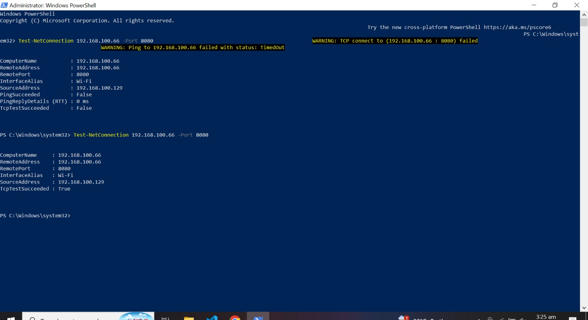
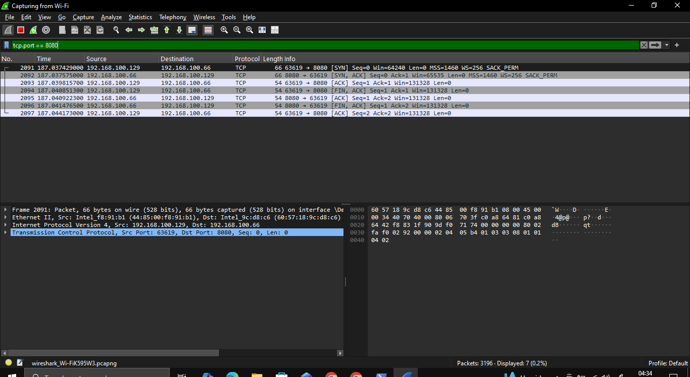
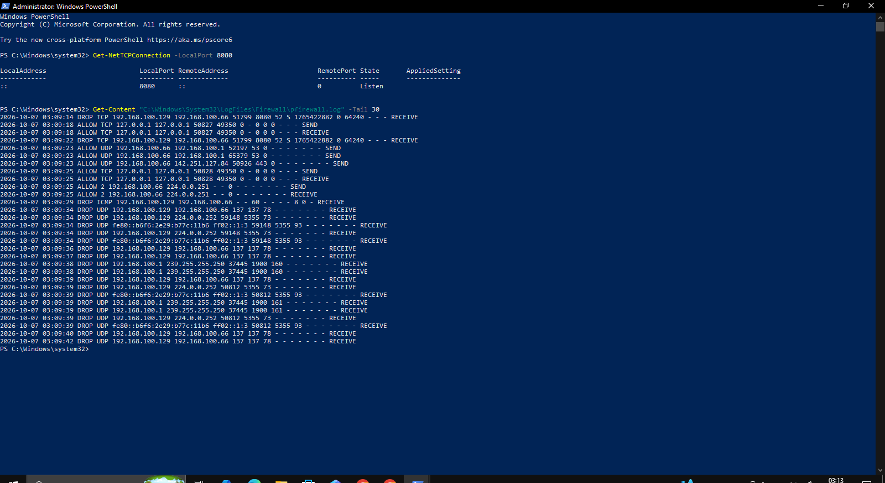

# Windows Firewall Security Lab

## Overview
This project demonstrates a hands-on Windows Firewall security lab focused on creating, testing, and verifying firewall rules in a controlled environment.

## Objectives
- Check Windows Firewall profile status
- Create inbound firewall rules
- Create outbound firewall rules
- Block and allow specific ports
- Verify firewall rule behavior
- Enable and review firewall logging
- Document all test results with screenshots

## Lab Environment
- Windows 10/11
- Windows Defender Firewall
- PowerShell
- GitHub

## Project Status
🚧 In Progress

## Disclaimer
This lab is performed only in a controlled and authorized environment for educational purposes.

## TCP Port 8080 Blocking Test

A temporary Python HTTP server was started on port `8080` on Laptop 1.

Laptop 2 then attempted to connect to Laptop 1 on TCP port `8080`.

The connection failed with:

`TcpTestSucceeded : False`

This confirmed that Windows Firewall successfully blocked the inbound connection.

## TCP Port 8080 Allowed Connection Test

A temporary Python HTTP server was running on port `8080` on Laptop 1.

Laptop 2 then attempted to connect to Laptop 1 on TCP port `8080`.

The connection succeeded with:

`TcpTestSucceeded : True`

This confirmed that Windows Firewall successfully allowed the inbound connection.

## Wireshark TCP Port 8080 Traffic Capture

Wireshark was used on Laptop 1 to capture TCP traffic on port `8080`.

The display filter used was:

`tcp.port == 8080`

Laptop 2 then connected to Laptop 1 on TCP port `8080`.

Wireshark successfully captured the TCP connection, including the SYN, SYN-ACK, ACK, and connection closing packets.

This confirmed that traffic on TCP port `8080` was successfully allowed and visible on the network.

## Windows Firewall Blocked Traffic Logging

Laptop 2 attempted to connect to Laptop 1 on TCP port `8080`.

The connection failed with:

`TcpTestSucceeded : False`

Laptop 1 then checked the Windows Firewall log.

The firewall log recorded the blocked connection with a `DROP TCP` entry for port `8080`.

This confirmed that Windows Firewall successfully blocked the connection and also logged the blocked traffic.

## Documentation

Detailed firewall lab documentation:

[View Firewall Lab Documentation](docs/firewall-lab-documentation.md)

PowerShell commands used in this lab:

[View Firewall PowerShell Commands](configs/firewall-rule-commands.ps1)
