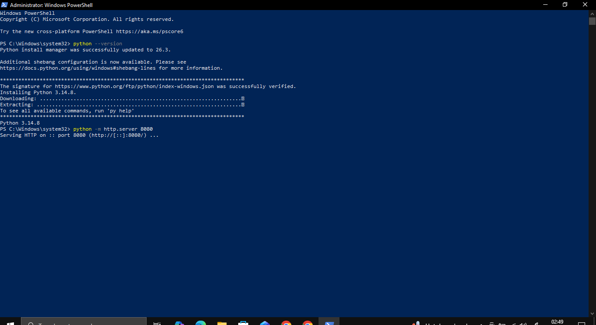
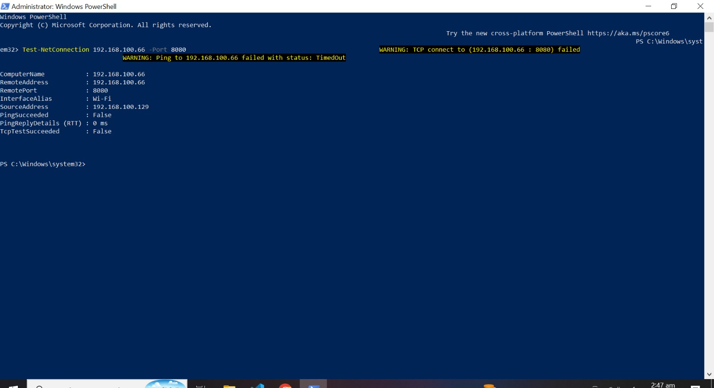
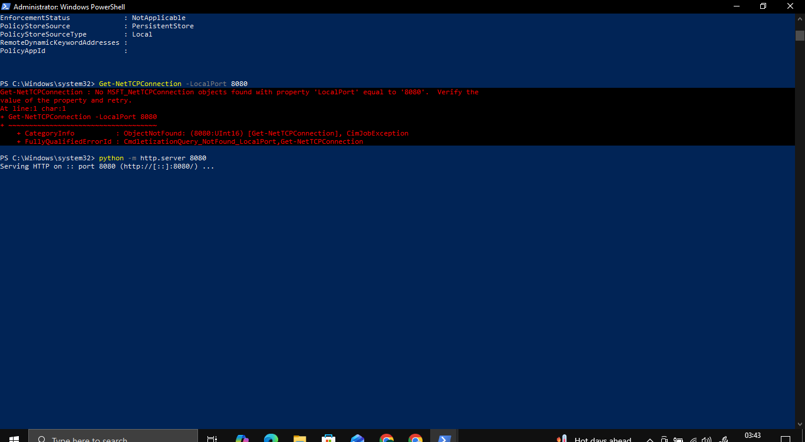

# Windows Firewall Security Lab

## Overview
This project demonstrates a hands-on Windows Firewall security lab focused on creating, testing, and verifying firewall rules in a controlled environment.

## Objectives
- Check Windows Firewall profile status
- Create inbound firewall rules
- Create outbound firewall rules
- Block and allow specific ports
- Verify firewall rule behavior
- Enable and review firewall logging
- Document all test results with screenshots

## Lab Environment
- Windows 10/11
- Windows Defender Firewall
- PowerShell
- GitHub

## Project Status
🚧 In Progress

## Disclaimer
This lab is performed only in a controlled and authorized environment for educational purposes.

## TCP Port 8080 Blocking Test

A temporary Python HTTP server was started on port `8080` on Laptop 1.

Laptop 2 then attempted to connect to Laptop 1 on TCP port `8080`.

The connection failed with:

`TcpTestSucceeded : False`

This confirmed that Windows Firewall successfully blocked the inbound connection.

## TCP Port 8080 Allowed Connection Test

A temporary Python HTTP server was running on port `8080` on Laptop 1.

Laptop 2 then attempted to connect to Laptop 1 on TCP port `8080`.

The connection succeeded with:

`TcpTestSucceeded : True`

This confirmed that Windows Firewall successfully allowed the inbound connection.

